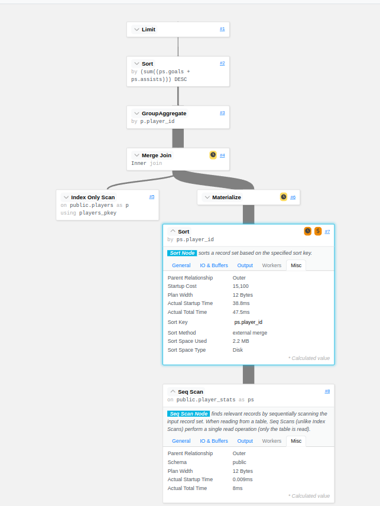
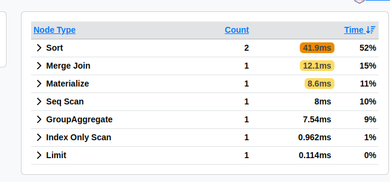

# Briefing

Anos atrás, recebi a missão de investigar e **resolver** a lentidão em um sistema crítico da firma. Foram noites mal dormidas e alguns fios a menos de cabelo. O backend utilizava PostgreSQL e, depois de muito suor e investigação, a solução veio em literalmente uma linha:

```sql
ALTER USER foo SET work_mem='32MB';
```

Sendo sincero, este conteúdo pode ou não resolver seu problema de maneira imediata; vai depender muito do padrão das queries do seu sistema. Mas, se você trabalha com backend, espero que este post traga mais uma opção no seu arsenal para resolver problemas de performance, especialmente no PostgreSQL :smile:.

Ao longo do post, vamos montar um cenário que facilita a degradação de performance e explorar algumas ferramentas pra investigar o problema a fundo, como o EXPLAIN, o k6 pra testes de carga, além de arriscar uma olhada no código-fonte do PostgreSQL. Também vou compartilhar alguns artigos que podem dar uma direção pra resolver problemas parecidos.

# Cenário

Vamos criar um sistema simples para analisar o desempenho de jogadores de futebol, por enquanto, a única necessidade de neǵocio é responder a seguinte pergunta:

- Qual o top N dos jogadores que mais tiveram participações em gols?

Para responder a essa pergunta, vamos modelar nosso banco de dados com três tabelas. O SQL a seguir cria e popula essas tabelas:

```sql
CREATE TABLE players (
    player_id SERIAL PRIMARY KEY,
    nationality TEXT,
    age INT,
    position TEXT
);

CREATE TABLE matches (
    match_id SERIAL PRIMARY KEY,
    match_date DATE,
    home_team TEXT,
    away_team TEXT
);

CREATE TABLE player_stats (
    player_stat_id SERIAL PRIMARY KEY,
    player_id INT REFERENCES players(player_id),
    match_id INT REFERENCES matches(match_id),
    goals INT,
    assists INT,
    minutes_played INT
);

-- Populate players with a range of nationalities, ages, and positions
INSERT INTO players (nationality, age, position)
SELECT
    ('Country' || (1 + random()*100)::int),  -- 100 different nationalities
    (18 + random()*20)::int,                 -- Ages between 18 and 38
    (ARRAY['Forward', 'Midfielder', 'Defender', 'Goalkeeper'])[ceil(random()*4)::int]
FROM generate_series(1, 10000);

-- Populate matches with random dates and team names
INSERT INTO matches (match_date, home_team, away_team)
SELECT
    CURRENT_DATE - (random()*365 * 2)::int,      -- Random date within the last two years
    ('Team' || (1 + random()*25)::int),      -- 50 different teams
    ('Team' || (25 + random()*25)::int)
FROM generate_series(1, 1000);

-- Populate player_stats with random stats for players in matches
-- Ensuring player_id is between 1 and 10,000, and match_id between 1 and 1,000
INSERT INTO player_stats (player_id, match_id, goals, assists, minutes_played)
SELECT
    (1 + trunc(random()*9999))::int,         -- Random player_id between 1 and 10,000
    (1 + trunc(random()*999))::int,          -- Random match_id between 1 and 1,000
    (random()*3)::int,                       -- Goals between 0 and 2
    (random()*2)::int,                       -- Assists between 0 and 1
    (45 + random()*45)::int                  -- Minutes played between 45 and 90
FROM generate_series(1, 100000);
```

O script para inicializar e popular o banco de dados está no [repositório do GitHub](link do projeto).

> E sim, poderíamos modelar os dados de forma que as queries fossem mais performáticas, mas o objetivo aqui é justamente explorar cenários não otimizados. Acredite, você provavelmente vai encontrar sistemas onde é preciso "tirar leite de pedra" para conseguir performance, seja por erros de modelagem ou crescimento inesperado.

# Debugando o Problema

Para simular o problema com work_mem, vamos formular a query para responder: Qual o top 2000 dos jogadores que mais contribuíram com gols? Ou seja, o somatório de assistências e gols por player_id, ordenado de forma decrescente:

```sql
SELECT p.player_id, SUM(ps.goals + ps.assists) AS total_score
FROM player_stats ps
JOIN players p ON ps.player_id = p.player_id
GROUP BY p.player_id
ORDER BY total_score DESC
LIMIT 2000;
```

Tá mas como identifico possíveis gargalos nessa query? Não só o PostgreSQL mas como outros DBMS do mercado suportam o comando ***[EXPLAIN](https://www.postgresql.org/docs/current/sql-explain.html)*** que detalha a sequência de passos, ou o plano de execução otimizado (ou não), que precisará ser percorrido e executado dado a query em questão. Podemos ver informações como:

- Qual o tipo da busca? Index scan, Index Only scan, Seq Scan, etc.
- Qual índice foi utilizado? E por qual condição?
- Se houver _Sort_, qual foi o algoritmo utilizado? Utilizou memória ou disco? 
- Uso de _[shared buffers](https://postgresqlco.nf/doc/en/param/shared_buffers/)_.
- Estimativas de tempo de execução.

Vc pode encontrar mais sobre o planner/optimizer na: 

- [documentação oficial](https://www.postgresql.org/docs/current/planner-optimizer.html)
- [pganalyze - basics of postgres query planning](https://pganalyze.com/docs/explain/basics-of-postgres-query-planning)
- [cybertec - how to interpret postgresql explain](https://www.cybertec-postgresql.com/en/how-to-interpret-postgresql-explain-analyze-output/?gad_source=1&gclid=CjwKCAiAudG5BhAREiwAWMlSjISvgthrORt-LxBH8K9hUhqvJ8B228ZBvHX9dM4MYD1xJ4iT6Z7P2BoCgTQQAvD_BwE)

## Talk is cheap

Falar é fácil então vamos análisar um exemplo prático. Primeiro vamos diminuir o work_mem para o menor valor possível, que é 64kB como podemos ver nesse trecho retirado do [código fonte](https://github.com/postgres/postgres/blob/master/src/backend/utils/sort/tuplesort.c#L695):

```C
	/*
	 * workMem is forced to be at least 64KB, the current minimum valid value
	 * for the work_mem GUC.  This is a defense against parallel sort callers
	 * that divide out memory among many workers in a way that leaves each
	 * with very little memory.
	 */
	state->allowedMem = Max(workMem, 64) * (int64) 1024;
```

E em seguida analisar o output do `EXPLAIN`:

```sql
BEGIN; -- 1. Iniciando uma transação.

SET LOCAL work_mem = '64kB'; -- 2. Alterando o valor de work_mem a nível de transação, outras transações na mesma sessão utilizará o valor default ou pré configurado.

SHOW work_mem; -- 3. Mostra o valor atualizado da configuração work_mem.

EXPLAIN (ANALYZE, COSTS, VERBOSE, BUFFERS) -- 4. Explain incluindo opções que ajudam a identificar gargalos, para mais informações olhe a seção de referências. 
SELECT 
    p.player_id, 
    SUM(ps.goals + ps.assists) AS total_score 
FROM 
    player_stats ps
INNER JOIN 
    players p ON p.player_id = ps.player_id
GROUP BY 
    p.player_id
ORDER BY 
    total_score DESC
LIMIT 2000;
--

QUERY PLAN                                                                                                                                                          |
--------------------------------------------------------------------------------------------------------------------------------------------------------------------+
Limit  (cost=18978.96..18983.96 rows=2000 width=12) (actual time=81.589..81.840 rows=2000 loops=1)                                                                  |
  Output: p.player_id, (sum((ps.goals + ps.assists)))                                                                                                               |
  Buffers: shared hit=667, temp read=860 written=977                                                                                                                |
  ->  Sort  (cost=18978.96..19003.96 rows=10000 width=12) (actual time=81.587..81.724 rows=2000 loops=1)                                                            |
        Output: p.player_id, (sum((ps.goals + ps.assists)))                                                                                                         |
        Sort Key: (sum((ps.goals + ps.assists))) DESC                                                                                                               |
        Sort Method: external merge  Disk: 280kB                                                                                                                    |
        Buffers: shared hit=667, temp read=860 written=977                                                                                                          |
        ->  GroupAggregate  (cost=15076.66..17971.58 rows=10000 width=12) (actual time=40.293..79.264 rows=9998 loops=1)                                            |
              Output: p.player_id, sum((ps.goals + ps.assists))                                                                                                     |
              Group Key: p.player_id                                                                                                                                |
              Buffers: shared hit=667, temp read=816 written=900                                                                                                    |
              ->  Merge Join  (cost=15076.66..17121.58 rows=100000 width=12) (actual time=40.281..71.313 rows=100000 loops=1)                                       |
                    Output: p.player_id, ps.goals, ps.assists                                                                                                       |
                    Merge Cond: (p.player_id = ps.player_id)                                                                                                        |
                    Buffers: shared hit=667, temp read=816 written=900                                                                                              |
                    ->  Index Only Scan using players_pkey on public.players p  (cost=0.29..270.29 rows=10000 width=4) (actual time=0.025..1.014 rows=10000 loops=1)|
                          Output: p.player_id                                                                                                                       |
                          Heap Fetches: 0                                                                                                                           |
                          Buffers: shared hit=30                                                                                                                    |
                    ->  Materialize  (cost=15076.32..15576.32 rows=100000 width=12) (actual time=40.250..57.942 rows=100000 loops=1)                                |
                          Output: ps.goals, ps.assists, ps.player_id                                                                                                |
                          Buffers: shared hit=637, temp read=816 written=900                                                                                        |
                          ->  Sort  (cost=15076.32..15326.32 rows=100000 width=12) (actual time=40.247..49.339 rows=100000 loops=1)                                 |
                                Output: ps.goals, ps.assists, ps.player_id                                                                                          |
                                Sort Key: ps.player_id                                                                                                              |
                                Sort Method: external merge  Disk: 2208kB                                                                                           |
                                Buffers: shared hit=637, temp read=816 written=900                                                                                  |
                                ->  Seq Scan on public.player_stats ps  (cost=0.00..1637.00 rows=100000 width=12) (actual time=0.011..8.378 rows=100000 loops=1)    |
                                      Output: ps.goals, ps.assists, ps.player_id                                                                                    |
                                      Buffers: shared hit=637                                                                                                       |
Planning:                                                                                                                                                           |
  Buffers: shared hit=6                                                                                                                                             |
Planning Time: 0.309 ms                                                                                                                                             |
Execution Time: 82.718 ms                                                                                                                                    |

COMMIT; -- 5. Aqui poderia ser um ROLLBACK, possibilitando analisar queries de INSERT, UPDATE e DELETE.
```

Podemos ver que o tempo de execução da query foi de **82.718ms** e que o algoritmo de _Sort_ utilizado foi o external merge, que usa disco em vez de memória dado que o conjunto de dados ultrapassou o 64kB de _work_mem_ configurado.

Por curiosidade, o módulo `tuplesort.c` marca que o algoritmo de _Sort_ irá utilizar disco setando o estado para _SORTEDONTAPE_ [nessa linha](https://github.com/postgres/postgres/blob/master/src/backend/utils/sort/tuplesort.c#L1394) e as iterações com o disco é exposto pelo módulo [logtape.c](https://github.com/postgres/postgres/blob/master/src/backend/utils/sort/logtape.c).

Se você é uma pessoa mais visual (como eu) existem ferramentas que facilitam o entendimento do output do EXPLAIN como https://explain.dalibo.com/, a imagem a seguir mostra um dos nós com a etapa de _Sort_ incluindo detalhes como `Sort Method: external merge` e `Sort Space Used: 2.2MB`:



A parte de "Stats" é super útil para queries mais complexas, mostrando o quanto cada nó contribuiu em tempo de execução da query, no nosso exemplo, ele já indicaria um potencial suspeito de nós do tipo _Sort_ que juntos levaram cerca de 42ms:



- Vc pode analisar e visualizar o explain dessa query no link: https://explain.dalibo.com/plan/2gd0a8c8fab6a532#stats

Como indicado pelo EXPLAIN um dos principais problemas de performance nessa query é o nó de Sort que está utilizando disco, inclusive, um efeito colateral que pode ser observado, principalmente se vc trabalhar com sistemas que possui uma quantidade considerável de usuários, é picos na métrica de Write I/O (espero que vc tenha métricas, caso contrário, sinta-se abraçado), e sim, a query de leitura pode causar spikes de escrita pq o algoritmo de Sort escreve em arquivos temporários.

## Solução

Se executarmos a mesma query setando `work_mem=4MB`(que é o default do postgres), o tempo de execução cai em aproximadamente 50%:

```sql
EXPLAIN (ANALYZE, COSTS, VERBOSE, BUFFERS) 
SELECT 
    p.player_id, 
    SUM(ps.goals + ps.assists) AS total_score 
FROM 
    player_stats ps
INNER JOIN 
    players p ON p.player_id = ps.player_id
GROUP BY 
    p.player_id
ORDER BY 
    total_score DESC
LIMIT 2000;
--
QUERY PLAN                                                                                                                                          |
----------------------------------------------------------------------------------------------------------------------------------------------------+
Limit  (cost=3646.90..3651.90 rows=2000 width=12) (actual time=41.672..41.871 rows=2000 loops=1)                                                    |
  Output: p.player_id, (sum((ps.goals + ps.assists)))                                                                                               |
  Buffers: shared hit=711                                                                                                                           |
  ->  Sort  (cost=3646.90..3671.90 rows=10000 width=12) (actual time=41.670..41.758 rows=2000 loops=1)                                              |
        Output: p.player_id, (sum((ps.goals + ps.assists)))                                                                                         |
        Sort Key: (sum((ps.goals + ps.assists))) DESC                                                                                               |
        Sort Method: top-N heapsort  Memory: 227kB                                                                                                  |
        Buffers: shared hit=711                                                                                                                     |
        ->  HashAggregate  (cost=2948.61..3048.61 rows=10000 width=12) (actual time=38.760..40.073 rows=9998 loops=1)                               |
              Output: p.player_id, sum((ps.goals + ps.assists))                                                                                     |
              Group Key: p.player_id                                                                                                                |
              Batches: 1  Memory Usage: 1169kB                                                                                                      |
              Buffers: shared hit=711                                                                                                               |
              ->  Hash Join  (cost=299.00..2198.61 rows=100000 width=12) (actual time=2.322..24.273 rows=100000 loops=1)                            |
                    Output: p.player_id, ps.goals, ps.assists                                                                                       |
                    Inner Unique: true                                                                                                              |
                    Hash Cond: (ps.player_id = p.player_id)                                                                                         |
                    Buffers: shared hit=711                                                                                                         |
                    ->  Seq Scan on public.player_stats ps  (cost=0.00..1637.00 rows=100000 width=12) (actual time=0.008..4.831 rows=100000 loops=1)|
                          Output: ps.player_stat_id, ps.player_id, ps.match_id, ps.goals, ps.assists, ps.minutes_played                             |
                          Buffers: shared hit=637                                                                                                   |
                    ->  Hash  (cost=174.00..174.00 rows=10000 width=4) (actual time=2.298..2.299 rows=10000 loops=1)                                |
                          Output: p.player_id                                                                                                       |
                          Buckets: 16384  Batches: 1  Memory Usage: 480kB                                                                           |
                          Buffers: shared hit=74                                                                                                    |
                          ->  Seq Scan on public.players p  (cost=0.00..174.00 rows=10000 width=4) (actual time=0.004..0.944 rows=10000 loops=1)    |
                                Output: p.player_id                                                                                                 |
                                Buffers: shared hit=74                                                                                              |
Planning:                                                                                                                                           |
  Buffers: shared hit=6                                                                                                                             |
Planning Time: 0.236 ms                                                                                                                             |
Execution Time: 41.998 ms                                                                                                                           |
```

- Se preferir uma análise visual: https://explain.dalibo.com/plan/b094ec2f1cfg44f6#


Perceba que nesse explain, um dos nós de Sort passou a utilizar um algoritmo que faz sort em memória _heapsort_, e por curiosidade, o planner decide por um heapsort somente se achar barato o suficiente em vez de mandar um quicksort, mais detalhes no [código fonte](https://github.com/postgres/postgres/blob/master/src/backend/utils/sort/tuplesort.c#L1229-L1252).


Além disso, o segundo nó de Sort que tomava mais tempo, aprox. 40ms simplesmente desapareceu do plano de execução da query, isso aconteceu pq o planner elencou um nó de `HashJoin` em vez de `MergeJoin` dado que agora a operação de hash cabe tranquilamente em memória, utilizando 480kB. Mais detalhes sobre os algoritmos de join nesses artigos:

- [HashJoin Algorithm](https://postgrespro.com/blog/pgsql/5969673)
- [MergeJoin Algorithm](https://postgrespro.com/blog/pgsql/5969770)

# Definindo o `work_mem`

Tá, mas depois de ter sonhos com o problema, de acordar N vezes durante a noite pra tentar mais uma solução ou debug e finalmente descobrir que o `work_mem` pode te ajudar, como definir um valor pra esssa configuração :grimacing:?

O valor padrão de _4MB_ para o work_mem, como muitas outras configurações do PostgreSQL (papo para outros posts) é conservador, não atoa conseguimos rodar em máquinas com pouco poder computacional, porém temos que ter cautela para não ter o risco de crashar o postgres com _Running out of memory_. **Uma única query se complexa o suficiente pode usar o valor de memória de múltiplos do configurado para o work_mem**, a depender do número de operações de _Sort_, _Merge Joins_, _Hash Joins_(work_mem multiplicado por hash_mem_multiplier) entre outras operações como destacado na [documentação oficial](https://www.postgresql.org/docs/current/runtime-config-resource.html#GUC-WORK-MEM):

>it is necessary to keep this fact in mind when choosing the value. Sort operations are used for ORDER BY, DISTINCT, and merge joins. Hash tables are used in hash joins, hash-based aggregation, memoize nodes and hash-based processing of IN subqueries.

Então como nem tudo são flores, não existe uma fórmula para ser aplicada cegamente, vai depender muito de memória RAM disponível, workload e padrões das queries do seu sistema. O [timescaleDB](https://github.com/timescale/timescaledb) possui uma ferramenta para [autotune](https://github.com/timescale/timescaledb-tune/tree/main) e esse assunto é bem discutido em vários artigos(excelentes por sinal) que podem te dar um norte:

- [Everything you know about work_mem is wrong](https://thebuild.com/blog/2023/03/13/everything-you-know-about-setting-work_mem-is-wrong/)
- [How should I tune work_mem for a given system](https://pganalyze.com/blog/5mins-postgres-work-mem-tuning#how-should-i-tune-work_mem-for-a-given-system)

Mas no fim do dia, IMHO a resposta para essa pergunta é: TESTE, TESTE HOJE, TESTE AMANHÃ, ~~TESTE PARA SEMPRE~~ até encontrar um valor aceitável para seu caso de uso que melhore a performance das queries do seu sistema sem explodir seu banco de dados xD

# Conclusão

- cautela ao subir o valor de work_mem, dado que pode ser multiplicado pelo número de nós utilizado pela query
- comentar sobre pooler, talvez tenha um controle mais previsivel sobre conexões e seja mais easy de calcular um work_mem seguro
- via de regra o valor default é mt baixo
- é possível alterar a nível de transação de banco para queries especificas


TODO

[x] script to populate the database
[x] queries to simulate the problem -- cant do it yet...
[x] deep dive in sorting methods of PostgreSQL, algorithms that used memory vs used disk
[x] also mentioning postgresql codebase
[x] practical example with a simple API and k6
[] topico solução em um API insights com k6 e etc
    [] falar de percentiles, talvez ter métricas de uso de memória? algum utilitário via linux com compose?
[] review portuguese mistakes
[] revisar links


============ 4MB work_mem k6 output =============
|      ✓ status is 200
| 
|      checks.........................: 100.00% 4275 out of 4275
|      data_received..................: 321 kB  7.1 kB/s
|      data_sent......................: 393 kB  8.7 kB/s
|      http_req_blocked...............: avg=7.18µs  min=1.71µs  med=5.35µs  max=551.7µs  p(90)=7.45µs   p(95)=8.68µs  
|      http_req_connecting............: avg=630ns   min=0s      med=0s      max=448.7µs  p(90)=0s       p(95)=0s      
|      http_req_duration..............: avg=71.77ms min=29.99ms med=76.67ms max=168.83ms p(90)=95.3ms   p(95)=100.53ms
|        { expected_response:true }...: avg=71.77ms min=29.99ms med=76.67ms max=168.83ms p(90)=95.3ms   p(95)=100.53ms
|      http_req_failed................: 0.00%   0 out of 4275
|      http_req_receiving.............: avg=90.41µs min=13.88µs med=77.02µs max=3.68ms   p(90)=115.28µs p(95)=159.52µs
|      http_req_sending...............: avg=21.4µs  min=6.39µs  med=18.21µs max=612.19µs p(90)=27.02µs  p(95)=32.85µs 
|      http_req_tls_handshaking.......: avg=0s      min=0s      med=0s      max=0s       p(90)=0s       p(95)=0s      
|      http_req_waiting...............: avg=71.66ms min=29.9ms  med=76.55ms max=168.71ms p(90)=95.18ms  p(95)=100.4ms 
|      http_reqs......................: 4275    94.931194/s
|      iteration_duration.............: avg=71.99ms min=30.17ms med=76.9ms  max=169.05ms p(90)=95.5ms   p(95)=100.74ms
|      iterations.....................: 4275    94.931194/s
|      vus............................: 1       min=1            max=10
|      vus_max........................: 10      min=10           max=10
| 
| 
| running (0m45.0s), 00/10 VUs, 4275 complete and 0 interrupted iterations
| default ✓ [ 100% ] 00/10 VUs  45s


============ 65kB work_mem k6 output =============
| 
|      ✓ status is 200
| 
|      checks.........................: 100.00% 2846 out of 2846
|      data_received..................: 214 kB  4.7 kB/s
|      data_sent......................: 245 kB  5.4 kB/s
|      http_req_blocked...............: avg=8.78µs   min=2.13µs  med=5.25µs   max=2.62ms   p(90)=7.19µs   p(95)=8.1µs   
|      http_req_connecting............: avg=1.04µs   min=0s      med=0s       max=429.38µs p(90)=0s       p(95)=0s      
|      http_req_duration..............: avg=108ms    min=61.55ms med=113.45ms max=198.55ms p(90)=138.63ms p(95)=143.01ms
|        { expected_response:true }...: avg=108ms    min=61.55ms med=113.45ms max=198.55ms p(90)=138.63ms p(95)=143.01ms
|      http_req_failed................: 0.00%   0 out of 2846
|      http_req_receiving.............: avg=84.49µs  min=18.43µs med=73.4µs   max=1.08ms   p(90)=109.13µs p(95)=149.98µs
|      http_req_sending...............: avg=22.68µs  min=6.49µs  med=17.67µs  max=2.37ms   p(90)=25.87µs  p(95)=30.11µs 
|      http_req_tls_handshaking.......: avg=0s       min=0s      med=0s       max=0s       p(90)=0s       p(95)=0s      
|      http_req_waiting...............: avg=107.89ms min=61.45ms med=113.35ms max=198.4ms  p(90)=138.52ms p(95)=142.91ms
|      http_reqs......................: 2846    63.204112/s
|      iteration_duration.............: avg=108.2ms  min=61.71ms med=113.83ms max=198.77ms p(90)=138.93ms p(95)=143.17ms
|      iterations.....................: 2846    63.204112/s
|      vus............................: 1       min=1            max=10
|      vus_max........................: 10      min=10           max=10
| 
| 
| running (0m45.0s), 00/10 VUs, 2846 complete and 0 interrupted iterations
| default ✓ [ 100% ] 00/10 VUs  45s
